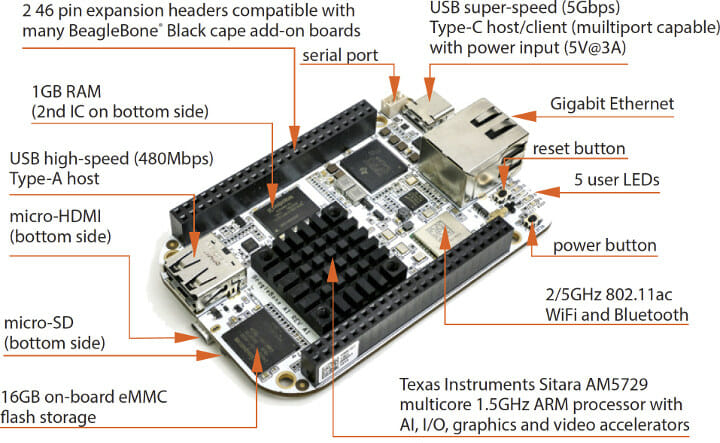

## NOTE: This hexapod project is still under development and may not be fully functional. So, please wait for an official release is coming soon!

# Hexapod Robot Control System

A comprehensive control system for a six-legged robot (hexapod) using BeagleBone AI (or Black), featuring both kernel-space drivers and user-space applications with reinforcement learning capabilities.

<p align="center">
  
</p>

## Project Overview

This project implements a complete software stack for controlling a 6-legged robot with 18 servo motors (3 per leg), including:

- **Kernel-Space Components**:
  - Linux kernel driver for servo control (PCA9685 PWM controllers)
  - IMU sensor driver (MPU6050) for orientation sensing
  - Hardware abstraction layer for unified device access
  
- **User-Space Components**: 
  - Kinematics library for precise leg positioning
  - Gait generation for various walking patterns
  - Calibration system for mechanical offset compensation
  - Interactive control interface

- **Reinforcement Learning**:
  - TD3 (Twin Delayed Deep Deterministic Policy Gradient) implementation
  - Hardware acceleration via TIDL and OpenCL
  - Simulation-to-real transfer capabilities
  - On-robot inference engine

## System Architecture

The system follows a layered architecture with hardware abstraction. For visual reference, see the architecture diagrams in the `/docs/diagrams/image` directory:

- [Deployment Diagram](docs/diagrams/image/deployment.png): Hardware and software deployment
- [Component Diagram](docs/diagrams/image/component.png): Hardware component interactions
- [Sequence Diagram](docs/diagrams/image/sequence.png): Runtime interactions
- [State Diagram](docs/diagrams/image/state.png): Hardware state transitions
- [Class Diagram](docs/diagrams/image/class.png): Software class structure
- [Building Process](docs/diagrams/image/building.png): Build and deployment process

```t
.
├── driver/          # Linux kernel device drivers
├── app/             # User applications and libraries
├── docs/            # Documentation
└── scripts/         # Build and utility scripts
```

## Features

- Multiple gait patterns (tripod, wave, ripple)
- Real-time IMU feedback
- Inverse kinematics for precise leg control
- Hardware abstraction layer
- Comprehensive test suite
- Interactive debugging tools

## Prerequisites

- BeagleBone AI (or Black) running Linux 4.14+
- I2C enabled (bus 3)
- 18x servo motors (MG996R recommended)
- 1x MPU6050 IMU sensor
- 2x PCA9685 PWM controllers

## Quick Start

1. Build the kernel module:
   ```bash
   ./scripts/build.sh -b driver
   ```

2. Install the kernel module on BeagleBone AI:
   ```bash
   ./install.sh
   ```

3. Build user-space applications:
   ```bash
   ./scripts/build.sh -b app
   ```

4. Run the test utility on BeagleBone AI:
   ```bash
   ./test_servo
   ```

## Development

See individual README files in subdirectories for detailed development guides:
- [Kernel Driver README](driver/README.md)
- [User Space README](app/README.md)
- [Hardware Overview README](hardware/README.md)
- [Cross-compile Environment README](docker/README.md)
- [Documentation](docs/README.md)

## Testing

Individual tests:
```bash
./test_servo       # Test servo control
./test_mpu6050     # Test IMU sensor
./test_movement    # Test movements like tripod, ripple, ...
./test_calibration # Test servos offset for each leg
./test_hcsr04      # Test HC-SR04 sensor
```

## Troubleshooting

### Sensor Issues
- **Zero IMU readings**: The MPU6050 enters sleep mode to save power. The driver now automatically wakes it before readings.
- **Erratic IMU behavior**: Check I2C connections and ensure proper power supply voltage.

### Servo Issues
- **Servos not moving**: Check power supply and ensure driver is properly loaded
- **Erratic movement**: Verify calibration settings and check for loose connections

## Documentation

- [Hardware Setup](docs/hardware.md)
- [Software Architecture](docs/architecture.md)
- [Quick Start Guide](docs/quickstart.md)

## Contributing

1. Fork the repository
2. Create a feature branch
3. Commit your changes
4. Push to the branch
5. Create a Pull Request

## License

[](LICENSE)
This project is licensed under the terms of the GNU General Public License v2.0.

## Authors

- StrongFood - I mean **"TrongPhuc"**

## Acknowledgments

- BeagleBoard.org
- Linux Kernel Community
