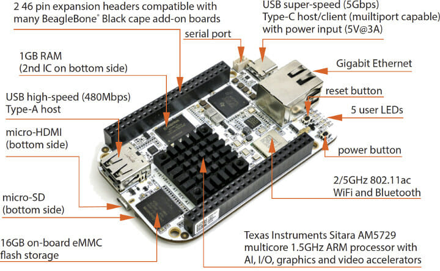

# Hexapod Hardware Documentation

## Overview

This document describes the hardware components of the hexapod robot and provides detailed specifications, wiring diagrams, and configuration information.

For detailed visual representation of hardware organization, see the [Component Diagram](diagrams/out/component.png) and [Deployment Diagram](diagrams/out/deployment.png).

## Robot Specifications

| Parameter             | Value                                      |
|-----------------------|--------------------------------------------|
| Dimensions            | 300mm × 300mm × 150mm (L×W×H)              |
| Weight                | ~1.5kg (without battery)                   |
| Operating Voltage     | 6V (servos), 5V (logic)                    |
| Power Consumption     | 2-10A depending on movement                |
| Maximum Speed         | ~0.3m/s                                    |
| Control Board         | BeagleBone AI/Black                        |
| Servo Motors          | 18× MG996R (or compatible)                 |
| Degrees of Freedom    | 18 (3 per leg)                             |
| Operating Time        | ~1 hour (with 5000mAh battery)             |
| Sensing               | 6-axis IMU (accelerometer + gyroscope)     |

## Component List

| Component                 | Quantity | Description                            |
|---------------------------|----------|----------------------------------------|
| BeagleBone AI/Black       | 1        | Main control board                     |
| MG996R Servo Motors       | 18       | 3 per leg (hip, knee, ankle)           |
| PCA9685 PWM Controller    | 2        | 16-channel PWM controller              |
| MPU6050 IMU Sensor        | 1        | 6-axis accelerometer + gyroscope       |
| 6V 10A Power Supply       | 1        | For powering servos                    |
| Voltage Regulator 5V      | 1        | For logic power                        |
| Aluminum/Plastic Brackets | 18       | For leg joints                         |
| Body Frame                | 1        | Central chassis                        |
| Leg Segments              | 18       | Connecting rods for legs               |
| Foot Pads                 | 6        | Non-slip contact points                |
| Wires and Connectors      | Assorted | For electrical connections             |
| Mounting Hardware         | Assorted | Screws, nuts, standoffs                |

## Mechanical Architecture

The hexapod follows a standard hexapod design with 6 legs arranged radially around a central body:

- **Body**: Hexagonal or circular platform housing the control electronics
- **Legs**: 6 legs with 3 joints each (hip, knee, ankle)
- **Joint Arrangement**:
  - Hip: Rotates horizontally (parallel to body)
  - Knee: Rotates vertically (perpendicular to hip)
  - Ankle: Rotates vertically (perpendicular to knee)

### Dimensions

- **Body Diameter**: 150mm
- **Leg Segments**:
  - Hip to Knee (COXA): 30mm
  - Knee to Ankle (FEMUR): 85mm
  - Ankle to Foot (TIBIA): 130mm
- **Total Leg Extension**: ~245mm fully extended

## Electrical Architecture

### Power System

- **Main Power**: 6V, 10A power supply or battery
- **Power Distribution**:
  - Separate power rails for servos and logic
  - Common ground between all components
- **Protection**:
  - Fuse on main power line (10A)
  - Reverse polarity protection
  - Logic level isolation between BeagleBone and servo power

### Control System

- **Main Controller**: BeagleBone AI/Black
  - AM335x 1GHz ARM Cortex-A8 processor
  - 512MB DDR3 RAM
  - Linux operating system

- **Servo Control**: Via PCA9685 PWM controllers
  - 2× PCA9685 boards (primary and secondary)
  - I2C communication from BeagleBone
  - 50Hz PWM signal generation

- **Sensing**:
  - MPU6050 IMU for orientation detection
  - Additional sensor connections available for expansion

## I2C Bus Configuration

The I2C bus 2 on BeagleBone is used for connecting sensors and actuators:

| Device            | I2C Address | Bus | Description                          |
|-------------------|-------------|-----|--------------------------------------|
| MPU6050           | 0x68        | 3   | 6-axis IMU sensor                    |
| PCA9685 Primary   | 0x40        | 3   | 16-channel PWM controller            |
| PCA9685 Secondary | 0x70        | 3   | 16-channel PWM controller (optional) |

### BeagleBone Pin Configuration

| BeagleBone Pin | Function   | Connected To               |
|----------------|------------|----------------------------|
| P9_19          | I2C2_SCL   | SCL of all I2C devices     |
| P9_20          | I2C2_SDA   | SDA of all I2C devices     |
| P9_1, P9_2     | GND        | Ground for all devices     |
| P9_7, P9_8     | SYS_5V     | Logic power for shields    |
| P9_3, P9_4     | DC_3.3V    | 3.3V sensors (e.g. MPU6050)|

## Servo Motor Specifications

Type: MG996R (or compatible) high-torque metal gear servo

| Parameter          | Specification                             |
|--------------------|-------------------------------------------|
| Operating Voltage  | 4.8V to 6.6V                              |
| Stall Torque       | 9.4 kg·cm (4.8V) / 11 kg·cm (6.0V)        |
| Speed              | 0.17 sec/60° (4.8V) / 0.14 sec/60° (6.0V) |
| Weight             | 55g                                        |
| Dimensions         | 40.7 × 19.7 × 42.9 mm                      |
| Control Signal     | PWM, 1-2ms pulse, 50Hz                     |
| Rotation Range     | 180° (controlled as ±90°)                  |
| Working Temperature| -30°C to +60°C                             |

## Servo Mapping

Each servo is connected to a specific channel on the PCA9685 controllers.

| Leg | Joint | PWM Channel | Controller |
|-----|-------|-------------|------------|
| 0   | Hip   | 0           | Primary    |
|     | Knee  | 1           | Primary    |
|_____| Ankle | 2           | Primary    |
| 1   | Hip   | 3           | Primary    |
|     | Knee  | 4           | Primary    |
|_____| Ankle | 5           | Primary    |
| 2   | Hip   | 6           | Primary    |
|     | Knee  | 7           | Primary    |
|_____| Ankle | 8           | Primary    |
| 3   | Hip   | 0           | Secondary  |
|     | Knee  | 1           | Secondary  |
|_____| Ankle | 2           | Secondary  |
| 4   | Hip   | 3           | Secondary  |
|     | Knee  | 4           | Secondary  |
|_____| Ankle | 5           | Secondary  |
| 5   | Hip   | 6           | Secondary  |
|     | Knee  | 7           | Secondary  |
|_____| Ankle | 8           | Secondary  |

Note: The secondary controller is optional. If using only one controller, leg 5's knee and ankle joints must be remapped to unused channels or a different solution implemented.

## MPU6050 IMU Configuration

The MPU6050 provides orientation data for the hexapod:

| Parameter           | Configuration                 |
|---------------------|-------------------------------|
| I2C Address         | 0x68                          |
| Accelerometer Range | ±2g                           |
| Gyroscope Range     | ±500 degrees/second           |
| Sample Rate         | 100Hz                         |
| Low-Pass Filter     | 10Hz                          |
| Orientation         | X forward, Y right, Z up      |

### Power Management

The MPU6050 has built-in power management features that may put it into sleep mode after periods of inactivity. The driver automatically handles waking the device when readings are requested, ensuring consistent sensor data even after extended periods between readings.

Key power management features:
- Sleep mode: Automatically entered to conserve power
- Wake-on-read: Driver automatically detects and wakes the device when readings are requested
- Clock source: PLL with X-axis gyroscope reference for stability

