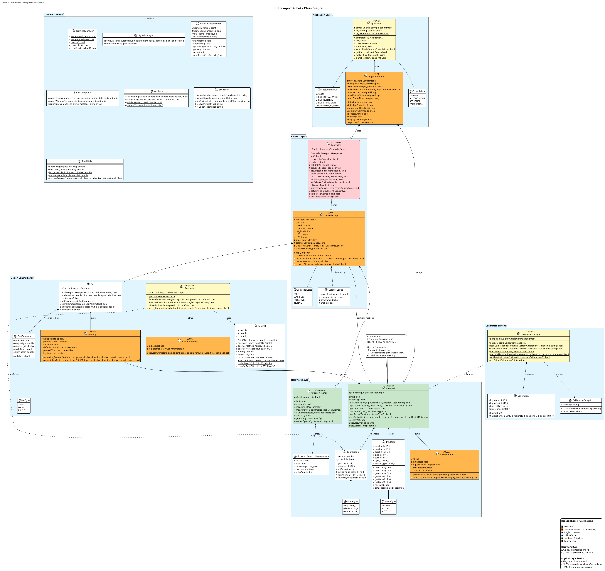

# Hexapod Robot System Architecture

This document describes the architecture of the reinforcement learning-enabled hexapod robot system, detailing the major components, their interactions, and the key design patterns used.

## System Overview

The hexapod robot system is a multi-layered architecture that combines hardware control, **Central Pattern Generator (CPG) networks**, biologically-inspired locomotion, and high-level control with reinforcement learning capabilities. The system is designed to be modular, extensible, and robust to environmental changes using bio-inspired oscillator networks that naturally produce coordinated gait patterns without traditional inverse kinematics calculations.

**Key Innovation**: This system replaces traditional Gait+IK (inverse kinematics) approaches with biologically-inspired Central Pattern Generators that create natural, adaptive locomotion patterns through coupled Hopf oscillators.



## Architectural Layers

The system is organized into the following layers, from lowest to highest level:

### 1. Hardware Layer

The hardware layer provides direct interaction with the physical components of the robot:

- **Kernel Driver**: Low-level kernel module for hardware access
- **Hardware Abstraction**: C++ interface to the kernel driver optimized for CPG real-time requirements
- **Sensor Integration**: IMU and ultrasonic sensor management with CPG feedback loops

#### Key Components:
- `hexapod::Hexapod`: Hardware abstraction layer for servo control with CPG output mapping
- `PCA9685` driver: PWM controller for servo motors (50Hz for biological rhythm compatibility)
- `MPU6050` and `ADXL345` drivers: IMU sensor interfaces for balance feedback to CPG networks
- `UltrasonicSensor`: HC-SR04 distance sensor interface for autonomous navigation with CPG integration

### 2. CPG-Based Motion Control Layer

The CPG (Central Pattern Generator) layer implements biologically-inspired locomotion control using Hopf oscillator networks, completely replacing traditional inverse kinematics:

- **Hopf Oscillators**: Six coupled oscillators, one per leg, generating natural rhythmic patterns
- **Biological Coordination**: Phase relationships automatically create stable gait patterns without manual programming
- **Direct Trajectory Generation**: Convert oscillator outputs directly to smooth 3D foot trajectories
- **Adaptive Behavior**: Natural response to perturbations and environmental changes through oscillator dynamics
- **No Inverse Kinematics**: The system generates joint angles directly from biological pattern generators

#### Key Components:
- `cpg::Network`: Network of coupled Hopf oscillators for coordinated locomotion
- `cpg::Oscillator`: Individual leg oscillator with nonlinear dynamics (ẋ = (μ - r²)x - ωy + coupling)
- `cpg::Controller`: High-level CPG control and gait management
- `cpg::TrajectoryGenerator`: Convert CPG outputs to joint trajectories using biological patterns
- `cpg::Parameters`: Configuration management for oscillator and coupling parameters

### 3. CPG Network Layer

The CPG network layer manages oscillator coordination and biological pattern generation:

- **Oscillator Coupling**: Configurable coupling matrix for different gait patterns (tripod, wave, ripple)
- **Phase Relationships**: Automatic synchronization between leg oscillators through biological coupling
- **Gait Transitions**: Smooth switching between tripod, wave, and ripple gaits through coupling matrix reconfiguration
- **Balance Integration**: Real-time IMU feedback for tilt compensation integrated into oscillator dynamics
- **Biological Stability**: Self-organizing patterns that automatically maintain stability without manual control

#### Key Components:
- `cpg::NetworkState`: Current state of all oscillators in the network with phase synchronization
- `cpg::ConnectionTopology`: Coupling configuration between oscillators for different biological gaits
- `cpg::GaitParams`: Parameters for different biological gait patterns (no traditional gait tables required)

### 4. Control Layer

The control layer provides high-level robot control fully integrated with CPG networks:

- **CPG Network Control**: Direct control of oscillator networks and biological parameters
- **Autonomous Navigation**: Ultrasonic sensor-based obstacle avoidance with CPG parameter modulation
- **Adaptive Balance System**: Active balance using IMU feedback integrated into CPG oscillator dynamics
- **Dynamic Locomotion**: Real-time gait adjustment based on terrain and conditions through oscillator coupling

#### Key Components:
- `cpg::Controller`: High-level CPG network controller replacing traditional gait controllers
- `cpg::BalanceSystem`: Balance system parameters integrated with CPG oscillator feedback

### 5. Application Layer

The application layer handles user interaction and system coordination with comprehensive CPG management:

- **User Interface**: Keyboard input and telemetry display with real-time CPG network visualization
- **System Management**: Initialization, shutdown, and error handling for CPG networks and oscillator states
- **Performance Monitoring**: Timing and metrics tracking for biological patterns and oscillator synchronization
- **CPG Parameter Control**: Real-time adjustment of oscillator parameters and coupling matrices

#### Key Components:
- `application::Application`: Main application singleton with integrated CPG management and monitoring
- `common::TerminalManager`: Terminal input handling for CPG control commands
- `common::SignalManager`: Signal handling for graceful CPG network shutdown
- `calibration::CalibrationManager`: Servo calibration management optimized for CPG output ranges

### 6. Reinforcement Learning Layer

The reinforcement learning layer provides adaptive behavior that works in harmony with the CPG system:

- **TD3 Algorithm**: Twin Delayed Deep Deterministic Policy Gradient with CPG network state inputs
- **CPG State Representation**: Robot state encoding including oscillator phases, coupling strengths, and synchronization metrics
- **CPG Parameter Optimization**: Transform RL outputs to CPG parameter modifications rather than direct joint commands
- **Biological Reward Functions**: Reward shaping based on natural locomotion efficiency and stability metrics

#### Key Components:
- `pytd3` module: Python implementation of TD3 algorithm with CPG network integration
- `td3bridge`: C++/Python communication interface for CPG parameter control and oscillator state monitoring

## Communication and Data Flow

### Internal Communication

Components communicate through well-defined interfaces with CPG networks at the core of all locomotion:

1. **Hardware to CPG**: The CPG system directly receives sensor feedback and generates servo commands without intermediate kinematic calculations
2. **CPG Oscillator Network**: Oscillators communicate through coupling matrices to generate synchronized biological patterns
3. **CPG to Trajectory Generation**: CPG oscillator outputs drive biologically-inspired trajectory generation with direct servo mapping
4. **CPG Network Coordination**: Real-time phase synchronization and coupling strength adjustment for adaptive gait patterns
5. **CPG to Application**: The application orchestrates CPG parameters based on user input and environmental conditions

### Mathematical Foundation

The CPG system is based on Hopf oscillator dynamics, completely replacing traditional inverse kinematics:

```t
ẋᵢ = (μ - rᵢ²)xᵢ - ωyᵢ + Σⱼ wᵢⱼ * coupling_inputⱼ
ẏᵢ = (μ - rᵢ²)yᵢ + ωxᵢ

Where:
- μ: bifurcation parameter (controls amplitude and stability)
- ω: intrinsic frequency (gait speed, typically 0.5-5 Hz)
- rᵢ² = xᵢ² + yᵢ² (oscillator amplitude)
- wᵢⱼ: coupling weight matrix (defines gait patterns)
- coupling_inputⱼ: influence from other oscillators

This creates stable limit cycles that naturally produce coordinated locomotion patterns
without requiring inverse kinematics calculations or manual gait programming.
```

### Biological Gait Generation

Unlike traditional systems that use pre-programmed gait tables, this system generates gaits through oscillator coupling:

- **Tripod Gait**: Anti-phase coupling between two groups of three legs (wᵢⱼ = -0.5 for opposite groups)
- **Wave Gait**: Sequential phase offsets through circular coupling topology (60° phase differences)
- **Ripple Gait**: Modified wave with overlapping swing phases for enhanced stability

### External Communication

The system communicates with external components through:

- **Kernel Interface**: IOCTL calls for hardware communication optimized for CPG real-time requirements
- **Python Bridge**: ZeroMQ-based interface for reinforcement learning integration with CPG network state monitoring
- **Telemetry Output**: Real-time system status display including CPG network visualization, oscillator phases, and coupling strengths

## Biological Inspiration and CPG Architecture

### Hopf Oscillator Networks

The system's core innovation is the use of biologically-inspired Central Pattern Generators that completely replace traditional gait generation and inverse kinematics:

- **Animal Locomotion**: Based on neural circuits found in walking animals (insects, mammals, and other hexapods)
- **Natural Coordination**: Phase relationships emerge automatically through coupling without manual programming
- **Adaptive Behavior**: Self-organizing patterns adapt to disturbances, terrain changes, and obstacles
- **Inherent Stability**: Limit cycle dynamics provide natural stability without requiring complex control algorithms
- **No Kinematic Calculations**: Direct generation of joint angles from biological patterns eliminates inverse kinematics complexity

### Biological Gait Pattern Generation

Different gaits emerge naturally from different coupling configurations, mimicking biological neural networks:

1. **Tripod Gait**: Two groups of three legs with anti-phase coupling (insects, fast locomotion)
2. **Wave Gait**: Sequential activation with 60° phase offsets (slow, stable locomotion)
3. **Ripple Gait**: Modified wave with adaptive phase relationships (medium speed, natural terrain adaptation)

### Advantages Over Traditional Gait+IK Systems

The CPG-based approach provides significant advantages over traditional Gait+IK systems:

- **Simplified Control**: No complex inverse kinematics calculations required
- **Natural Adaptation**: Automatic response to disturbances and terrain changes
- **Biological Realism**: Patterns closely match those found in nature
- **Computational Efficiency**: Simple differential equations vs. complex kinematic chains
- **Robustness**: Self-stabilizing dynamics vs. manually tuned controllers
- **Smooth Transitions**: Natural gait switching vs. abrupt pattern changes
3. **Ripple Gait**: Modified wave with adaptive phase relationships

## Key Design Patterns

### 1. PIMPL (Pointer to Implementation)

The system extensively uses the PIMPL idiom to:
- Hide implementation details
- Maintain ABI stability
- Reduce compilation dependencies

Example implementation:
```cpp
// Header file
class Controller {
public:
    Controller(hexapod::Hexapod &hexapod);
    ~Controller();
    bool init();
    // Public API methods
private:
    std::unique_ptr<ControllerImpl> pImpl;
};

// Implementation file
class ControllerImpl {
public:
    ControllerImpl(hexapod::Hexapod &hexapod) : hexapod(hexapod) {}
    // Implementation details
    hexapod::Hexapod &hexapod;
};

Controller::Controller(hexapod::Hexapod &hexapod)
    : pImpl(std::make_unique<ControllerImpl>(hexapod)) {}
```

### 2. Singleton Pattern

Singletons are used for system-wide resources:
- `Application`: Main application controller
- `cpg::TrajectoryGenerator`: Shared trajectory generation from CPG outputs
- `CalibrationManager`: Centralized calibration management

Example implementation:
```cpp
class TrajectoryGenerator {
public:
    static TrajectoryGenerator& getInstance() {
        static TrajectoryGenerator instance;
        return instance;
    }
    
    // Delete copy and move operations
    TrajectoryGenerator(const TrajectoryGenerator&) = delete;
    TrajectoryGenerator& operator=(const TrajectoryGenerator&) = delete;
    TrajectoryGenerator(TrajectoryGenerator&&) = delete;
    TrajectoryGenerator& operator=(TrajectoryGenerator&&) = delete;

private:
    TrajectoryGenerator() {}
};
```

### 3. Strategy Pattern

The system uses the strategy pattern for different CPG configurations and control modes:
- Different gait patterns (tripod, wave, ripple) use different coupling matrices
- Control modes (manual, autonomous) can switch CPG parameters at runtime
- Oscillator coupling strategies can be changed dynamically

### 4. Observer Pattern

The system implements observer patterns for monitoring CPG networks:
- Signal handlers observe system signals
- Performance monitors observe oscillator synchronization
- Balance systems observe CPG network state for stability

### 5. Factory Pattern

Factory patterns are used for creating specialized CPG objects:
- Oscillator parameter creation for different gaits
- Coupling matrix generation for hexapod topology
- Network configuration initialization

## Error Handling Strategy

The system implements a comprehensive error handling approach:

1. **Error Classification**: Errors are categorized by type (hardware, communication, etc.)
2. **Error Propagation**: Errors propagate upward with additional context
3. **Retry Logic**: Critical operations have built-in retry mechanisms
4. **Graceful Degradation**: The system continues operating with reduced functionality when possible

Example error handling:
```cpp
bool Hexapod::setLegPosition(uint8_t leg_num, const LegPosition &position)
{
    if (!pImpl->initialized) {
        pImpl->setError(ErrorInfo::ErrorCode::NOT_INITIALIZED, ErrorCategory::PARAMETER,
                       "Hexapod not initialized");
        return false;
    }
    
    // Implement retry logic for hardware operations
    for (int retry = 0; retry < MAX_RETRIES; retry++) {
        if (sendPositionCommand(leg_num, position))
            return true;
            
        if (retry < MAX_RETRIES - 1)
            usleep(RETRY_DELAY_US);
    }
    
    pImpl->setError(ErrorInfo::ErrorCode::COMM_ERROR, ErrorCategory::COMMUNICATION,
                   "Failed to set leg position after retries");
    return false;
}
```
