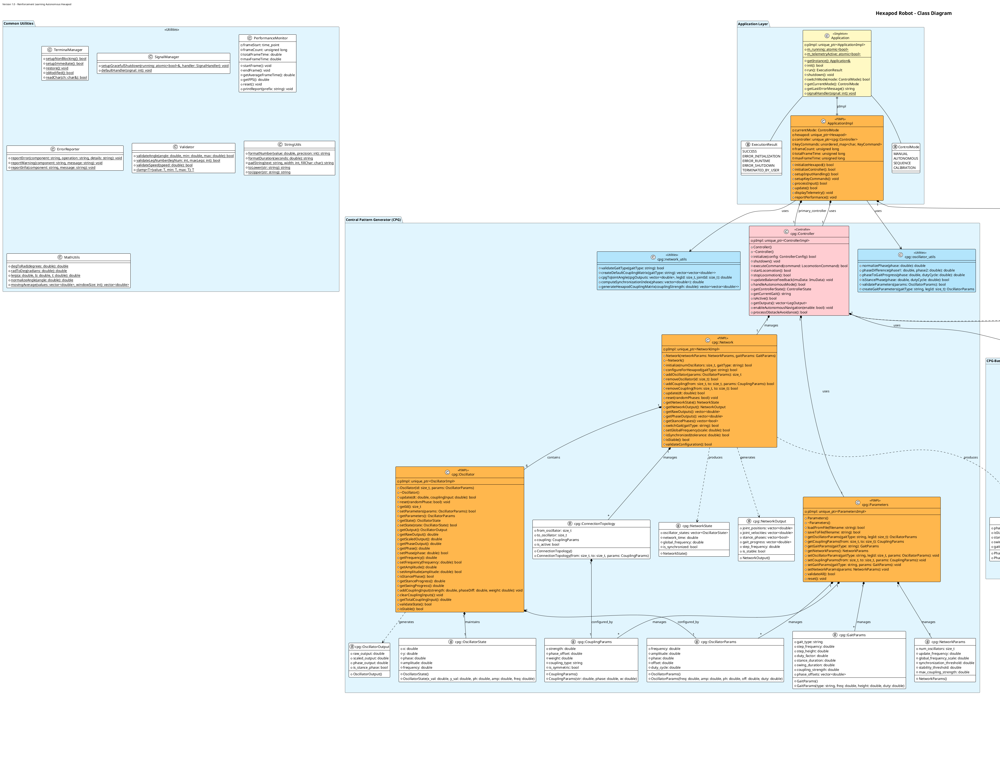

# Hexapod Robot System Architecture

This document describes the architecture of the reinforcement learning-enabled hexapod robot system, detailing the major components, their interactions, and the key design patterns used.

## System Overview

The hexapod robot system is a multi-layered architecture that combines hardware control, kinematics, gait generation, and high-level control with reinforcement learning capabilities. The system is designed to be modular, extensible, and robust to environmental changes.



## Architectural Layers

The system is organized into the following layers, from lowest to highest level:

### 1. Hardware Layer

The hardware layer provides direct interaction with the physical components of the robot:

- **Kernel Driver**: Low-level kernel module for hardware access
- **Hardware Abstraction**: C++ interface to the kernel driver
- **Sensor Integration**: IMU and ultrasonic sensor management

#### Key Components:
- `hexapod::Hexapod`: Hardware abstraction layer for servo control
- `PCA9685` driver: PWM controller for servo motors
- `MPU6050` and `ADXL345` drivers: IMU sensor interfaces
- `UltrasonicSensor`: HC-SR04 distance sensor interface

### 2. Kinematics Layer

The kinematics layer handles the mathematical models for leg positioning:

- **Forward Kinematics**: Calculate leg positions from joint angles
- **Inverse Kinematics**: Calculate joint angles from desired positions
- **3D Geometry**: Vector operations and transformations

#### Key Components:
- `kinematics::Kinematics`: Singleton class providing forward and inverse kinematics
- `kinematics::Point3D`: 3D vector class with mathematical operations

### 3. Gait Layer

The gait layer manages leg movement patterns and coordination:

- **Gait Patterns**: Tripod, wave, and ripple gaits
- **Trajectory Generation**: Calculate foot paths for smooth movement
- **Gait Parameters**: Configurable stepping height, length, and timing

#### Key Components:
- `gait::Gait`: Gait pattern generator
- `gait::GaitParameters`: Configuration for different gait types

### 4. Control Layer

The control layer provides high-level robot control:

- **Movement Control**: Direction and speed management
- **Balance System**: Active balance using IMU feedback
- **Obstacle Avoidance**: Distance-based movement adjustment

#### Key Components:
- `controller::Controller`: High-level robot controller
- `controller::BalanceConfig`: Balance system parameters

### 5. Application Layer

The application layer handles user interaction and system coordination:

- **User Interface**: Keyboard input and telemetry display
- **System Management**: Initialization, shutdown, and error handling
- **Performance Monitoring**: Timing and metrics tracking

#### Key Components:
- `application::Application`: Main application singleton
- `common::TerminalManager`: Terminal input handling
- `common::SignalManager`: Signal handling for graceful shutdown
- `calibration::CalibrationManager`: Servo calibration management

### 6. Reinforcement Learning Layer

The reinforcement learning layer provides adaptive behavior:

- **TD3 Algorithm**: Twin Delayed Deep Deterministic Policy Gradient
- **State Representation**: Robot state encoding
- **Action Mapping**: Transform RL outputs to robot commands

#### Key Components:
- `pytd3` module: Python implementation of TD3 algorithm
- `td3bridge`: C++/Python communication interface

## Communication and Data Flow

### Internal Communication

Components communicate through well-defined interfaces:

1. **Hardware to Kinematics**: The kinematics layer translates between joint angles and 3D positions
2. **Kinematics to Gait**: The gait layer uses kinematics to generate coordinated leg movements
3. **Gait to Controller**: The controller uses the gait generator to produce walking patterns
4. **Controller to Application**: The application orchestrates the controller based on user input

### External Communication

The system communicates with external components through:

- **Kernel Interface**: IOCTL calls for hardware communication
- **Python Bridge**: ZeroMQ-based interface for reinforcement learning integration
- **Telemetry Output**: Real-time system status display

## Key Design Patterns

### 1. PIMPL (Pointer to Implementation)

The system extensively uses the PIMPL idiom to:
- Hide implementation details
- Maintain ABI stability
- Reduce compilation dependencies

Example implementation:
```cpp
// Header file
class Controller {
public:
    Controller(hexapod::Hexapod &hexapod);
    ~Controller();
    bool init();
    // Public API methods
private:
    std::unique_ptr<ControllerImpl> pImpl;
};

// Implementation file
class ControllerImpl {
public:
    ControllerImpl(hexapod::Hexapod &hexapod) : hexapod(hexapod) {}
    // Implementation details
    hexapod::Hexapod &hexapod;
};

Controller::Controller(hexapod::Hexapod &hexapod)
    : pImpl(std::make_unique<ControllerImpl>(hexapod)) {}
```

### 2. Singleton Pattern

Singletons are used for system-wide resources:
- `Application`: Main application controller
- `Kinematics`: Shared kinematics calculations
- `CalibrationManager`: Centralized calibration management

Example implementation:
```cpp
class Kinematics {
public:
    static Kinematics& getInstance() {
        static Kinematics instance;
        return instance;
    }
    
    // Delete copy and move operations
    Kinematics(const Kinematics&) = delete;
    Kinematics& operator=(const Kinematics&) = delete;
    Kinematics(Kinematics&&) = delete;
    Kinematics& operator=(Kinematics&&) = delete;

private:
    Kinematics() {}
};
```

### 3. Strategy Pattern

The system uses the strategy pattern for different gait types and control modes:
- Different gaits (tripod, wave, ripple) share a common interface
- Control modes (manual, autonomous) can be switched at runtime

### 4. Observer Pattern

The system implements observer patterns for monitoring:
- Signal handlers observe system signals
- Performance monitors observe system metrics

### 5. Factory Pattern

Factory patterns are used for creating specialized objects:
- Gait pattern creation
- Calibration data initialization

## Error Handling Strategy

The system implements a comprehensive error handling approach:

1. **Error Classification**: Errors are categorized by type (hardware, communication, etc.)
2. **Error Propagation**: Errors propagate upward with additional context
3. **Retry Logic**: Critical operations have built-in retry mechanisms
4. **Graceful Degradation**: The system continues operating with reduced functionality when possible

Example error handling:
```cpp
bool Hexapod::setLegPosition(uint8_t leg_num, const LegPosition &position)
{
    if (!pImpl->initialized) {
        pImpl->setError(ErrorInfo::ErrorCode::NOT_INITIALIZED, ErrorCategory::PARAMETER,
                       "Hexapod not initialized");
        return false;
    }
    
    // Implement retry logic for hardware operations
    for (int retry = 0; retry < MAX_RETRIES; retry++) {
        if (sendPositionCommand(leg_num, position))
            return true;
            
        if (retry < MAX_RETRIES - 1)
            usleep(RETRY_DELAY_US);
    }
    
    pImpl->setError(ErrorInfo::ErrorCode::COMM_ERROR, ErrorCategory::COMMUNICATION,
                   "Failed to set leg position after retries");
    return false;
}
```
